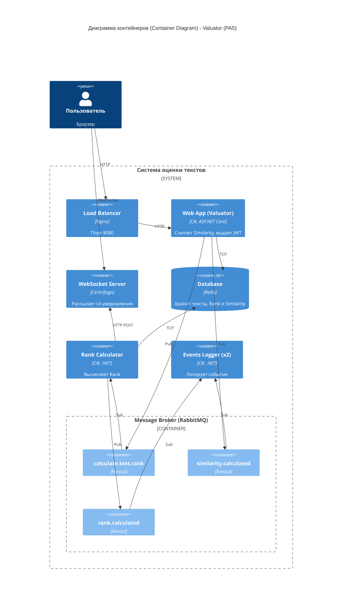

```mermaid
C4Container
    title Диаграмма контейнеров (Container Diagram) - Valuator (PA5)

    Person(user, "Пользователь", "Браузер")
    
    System_Boundary(system, "Система оценки текстов") {
        Container(lb, "Load Balancer", "Nginx", "Порт 8080")
        Container(webapp, "Web App (Valuator)", "C#, ASP.NET Core", "Считает Similarity, выдает JWT")
        Container(centrifugo, "WebSocket Server", "Centrifugo", "Рассылает UI-уведомления")
        
        ContainerDb(db, "Database", "Redis", "Хранит тексты, Rank и Similarity")
        
        Container(worker, "Rank Calculator", "C#, .NET", "Вычисляет Rank")
        Container(logger, "Events Logger (x2)", "C#, .NET", "Логирует события")
        
        Container_Boundary(rabbitmq, "Message Broker (RabbitMQ)") {
            Component(task_exchange, "calculate.text.rank", "Fanout")
            Component(sim_exchange, "similarity.calculated", "Fanout")
            Component(rank_exchange, "rank.calculated", "Fanout")
        }
    }

    %% Взаимодействие пользователя
    Rel(user, lb, "HTTP")
    Rel(user, centrifugo, "WebSocket")
    
    Rel(lb, webapp, "HTTP")
    
    %% Работа с БД (группируем связи к БД)
    Rel(webapp, db, "TCP")
    Rel(worker, db, "TCP")
    
    %% Задачи на расчет (поток: Web -> Rabbit -> Worker)
    Rel(webapp, task_exchange, "Pub")
    Rel(task_exchange, worker, "Sub")
    
    %% Уведомление фронтенда
    Rel(worker, centrifugo, "HTTP POST")
    
    %% События (поток к логгерам)
    Rel(webapp, sim_exchange, "Pub")
    Rel(worker, rank_exchange, "Pub")
    
    Rel(sim_exchange, logger, "Sub")
    Rel(rank_exchange, logger, "Sub")
```