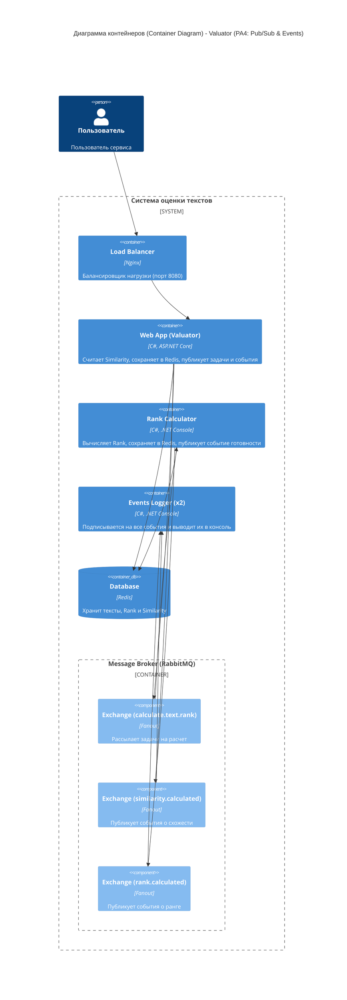

```mermaid
C4Container
    title Диаграмма контейнеров (Container Diagram) - Valuator (PA4: Pub/Sub & Events)

    Person(user, "Пользователь", "Пользователь сервиса")
    
    System_Boundary(system, "Система оценки текстов") {
        Container(lb, "Load Balancer", "Nginx", "Балансировщик нагрузки (порт 8080)")
        
        Container(webapp, "Web App (Valuator)", "C#, ASP.NET Core", "Считает Similarity, сохраняет в Redis, публикует задачи и события")
        
        Container_Boundary(rabbitmq, "Message Broker (RabbitMQ)") {
            Component(task_exchange, "Exchange (calculate.text.rank)", "Fanout", "Рассылает задачи на расчет")
            Component(sim_exchange, "Exchange (similarity.calculated)", "Fanout", "Публикует события о схожести")
            Component(rank_exchange, "Exchange (rank.calculated)", "Fanout", "Публикует события о ранге")
        }

        Container(worker, "Rank Calculator", "C#, .NET Console", "Вычисляет Rank, сохраняет в Redis, публикует событие готовности")
        
        Container(logger, "Events Logger (x2)", "C#, .NET Console", "Подписывается на все события и выводит их в консоль")
        
        ContainerDb(db, "Database", "Redis", "Хранит тексты, Rank и Similarity")
    }

    Rel(user, lb, "", "")
    Rel(lb, webapp, "", "")
    
    Rel(webapp, db, "", "")
    Rel(webapp, task_exchange, "", "")
    Rel(webapp, sim_exchange, "", "")
    
    Rel(worker, db, "", "")
    Rel(worker, rank_exchange, "", "")
    
    Rel(sim_exchange, logger, "", "")
    Rel(rank_exchange, logger, "", "")
    Rel(task_exchange, worker, "", "")
```