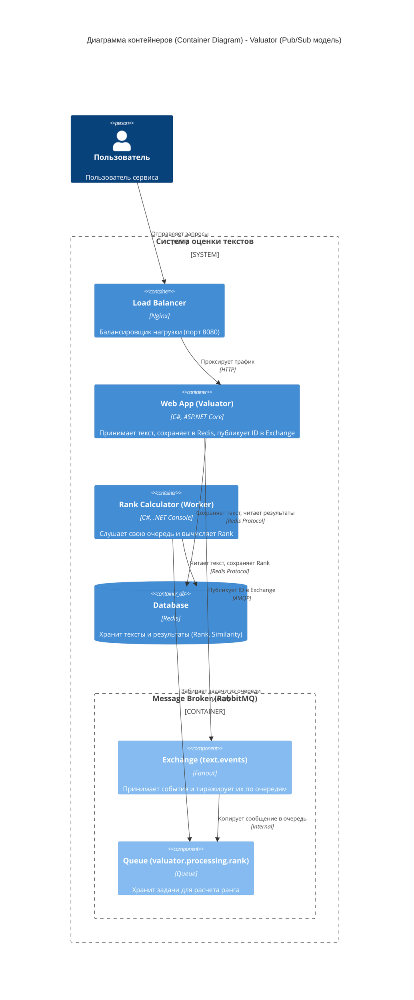

```mermaid
C4Container
    title Диаграмма контейнеров (Container Diagram) - Valuator (Pub/Sub модель)

    Person(user, "Пользователь", "Пользователь сервиса")
    
    System_Boundary(system, "Система оценки текстов") {
        Container(lb, "Load Balancer", "Nginx", "Балансировщик нагрузки (порт 8080)")
        
        Container(webapp, "Web App (Valuator)", "C#, ASP.NET Core", "Принимает текст, сохраняет в Redis, публикует ID в Exchange")
        
        Container_Boundary(rabbitmq, "Message Broker (RabbitMQ)") {
            Component(exchange, "Exchange (text.events)", "Fanout", "Принимает события и тиражирует их по очередям")
            Component(queue, "Queue (valuator.processing.rank)", "Queue", "Хранит задачи для расчета ранга")
        }

        Container(worker, "Rank Calculator (Worker)", "C#, .NET Console", "Слушает свою очередь и вычисляет Rank")
        
        ContainerDb(db, "Database", "Redis", "Хранит тексты и результаты (Rank, Similarity)")
    }

    Rel(user, lb, "Отправляет запросы", "HTTP")
    Rel(lb, webapp, "Проксирует трафик", "HTTP")
    
    Rel(webapp, db, "Сохраняет текст, читает результаты", "Redis Protocol")
    Rel(webapp, exchange, "Публикует ID в Exchange", "AMQP")
    
    Rel(exchange, queue, "Копирует сообщение в очередь", "Internal")
    
    Rel(worker, queue, "Забирает задачи из очереди", "AMQP")
    Rel(worker, db, "Читает текст, сохраняет Rank", "Redis Protocol")
```