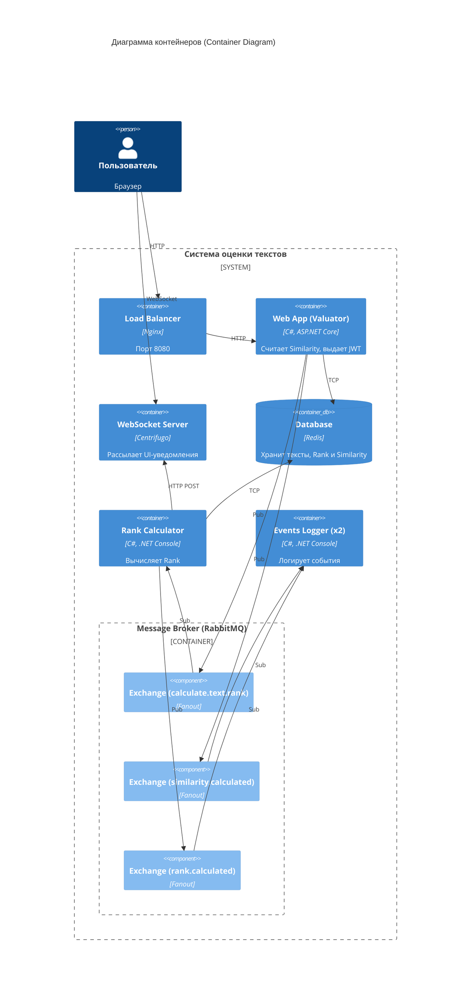
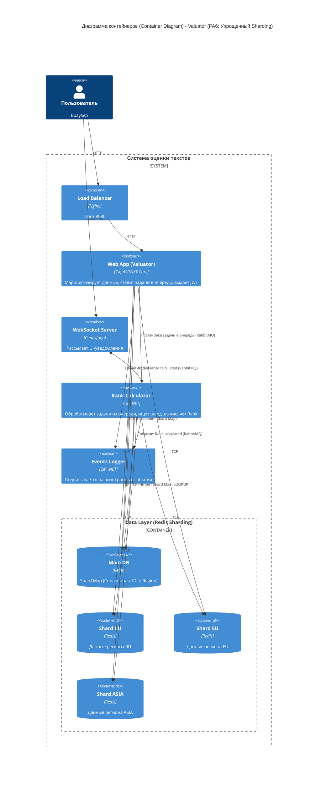

```mermaid
C4Container
    title Диаграмма контейнеров (Container Diagram)

    Person(user, "Пользователь", "Браузер")
    
    System_Boundary(system, "Система оценки текстов") {
        Container(lb, "Load Balancer", "Nginx", "Порт 8080")
        
        Container(webapp, "Web App (Valuator)", "C#, ASP.NET Core", "Считает Similarity, выдает JWT")
        
        Container(centrifugo, "WebSocket Server", "Centrifugo", "Рассылает UI-уведомления")
        
        ContainerDb(db, "Database", "Redis", "Хранит тексты, Rank и Similarity")
        
        Container_Boundary(rabbitmq, "Message Broker (RabbitMQ)") {
            Component(task_exchange, "Exchange (calculate.text.rank)", "Fanout")
            Component(sim_exchange, "Exchange (similarity.calculated)", "Fanout")
            Component(rank_exchange, "Exchange (rank.calculated)", "Fanout")
        }

        Container(worker, "Rank Calculator", "C#, .NET Console", "Вычисляет Rank")
        
        Container(logger, "Events Logger (x2)", "C#, .NET Console", "Логирует события")
    }

    Rel(user, lb, "HTTP")
    Rel(user, centrifugo, "WebSocket")
    
    Rel(lb, webapp, "HTTP")

    Rel(webapp, db, "TCP")
    Rel(webapp, task_exchange, "Pub")
    Rel(webapp, sim_exchange, "Pub")

    Rel(task_exchange, worker, "Sub")
    Rel(worker, db, "TCP")
    Rel(worker, rank_exchange, "Pub")
    Rel(worker, centrifugo, "HTTP POST")

    Rel(sim_exchange, logger, "Sub")
    Rel(rank_exchange, logger, "Sub")
```

```mermaid
C4Container
    title Диаграмма контейнеров (Container Diagram) - Valuator (PA6: Упрощенный Sharding)

    Person(user, "Пользователь", "Браузер")
    
    System_Boundary(system, "Система оценки текстов") {
        Container(lb, "Load Balancer", "Nginx", "Порт 8080")
        
        Container(webapp, "Web App (Valuator)", "C#, ASP.NET Core", "Маршрутизирует данные, ставит задачи в очередь, выдает JWT")
        Container(centrifugo, "WebSocket Server", "Centrifugo", "Рассылает UI-уведомления")

        Container_Boundary(db_layer, "Data Layer (Redis Sharding)") {
            ContainerDb(db_main, "Main DB", "Redis", "Shard Map (Справочная: ID -> Region)")
            ContainerDb(db_ru, "Shard RU", "Redis", "Данные региона RU")
            ContainerDb(db_eu, "Shard EU", "Redis", "Данные региона EU")
            ContainerDb(db_asia, "Shard ASIA", "Redis", "Данные региона ASIA")
        }
        
        Container(worker, "Rank Calculator", "C#, .NET", "Обрабатывает задачи из очереди, ищет шард, вычисляет Rank")
        Container(logger, "Events Logger", "C#, .NET", "Подписывается на асинхронные события")
    }

    Rel(user, lb, "HTTP")
    Rel(user, centrifugo, "WebSocket")
    Rel(lb, webapp, "HTTP")
    
    Rel_D(webapp, worker, "Постановка задачи в очередь (RabbitMQ)")
    
    Rel_D(webapp, logger, "Событие: Similarity calculated (RabbitMQ)")
    Rel_D(worker, logger, "Событие: Rank calculated (RabbitMQ)")
    
    Rel(worker, centrifugo, "HTTP POST")

    Rel(webapp, db_main, "TCP (Сохраняет Shard Map)")
    Rel(worker, db_main, "TCP (Читает Shard Map: LOOKUP)")
    
    Rel(webapp, db_ru, "TCP")
    Rel(webapp, db_eu, "TCP")
    Rel(webapp, db_asia, "TCP")
    
    Rel(worker, db_ru, "TCP")
    Rel(worker, db_eu, "TCP")
    Rel(worker, db_asia, "TCP")
```
